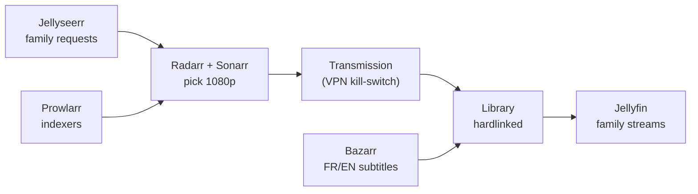

<!-- Profile README — alexis-morain. The CAP_PRS block is auto-updated daily, do not remove its markers. -->

<div align="center">


<a href="https://github.com/alexis-morain">
  
</a>

<p>
  <a href="https://www.malt.fr/profile/alexismorain">
    
  </a>
  <a href="https://www.linkedin.com/in/alexis-morain/">
    
  </a>
  <a href="mailto:alexis@morain.fr">
    
  </a>
  
</p>

</div>

---

## 👋 About me

```yaml
name:        Alexis Morain
role:        Builder, indie hacker, freelance growth + automation
location:    France 🇫🇷
focus:       shipping small useful products, self-hosting, automating workflows
currently:   running a full homelab media stack and a self-hosted CRM
open_to:     freelance missions (Malt) and interesting collaborations
```

I like building things end to end: a Python bot, a React app, an n8n workflow, a Docker stack behind Traefik. I run my own infrastructure on a VPS and a home NAS, and I contribute the fixes I need back to the open source tools I use.

---

## 🚀 What I'm building

| Project | Stack | What it does |
|---|---|---|
| **[saasradar](https://github.com/alexis-morain/saasradar)** | TypeScript | Curated directory of SaaS tools, independently reviewed |
| **[secret-santa](https://github.com/alexis-morain/secret-santa)** | React · Vite | Festive Secret Santa web app, no signup, shareable links 🎅 |

A few more I keep private for now: a Polymarket quant bot betting on Paris daily max temperature, a dual-momentum (GEM Antonacci) rebalancer for Trading 212, and my personal site built with Astro.

---

## 🏠 Self-hosted homelab

I run a full self-hosted stack across an OVH VPS and a home NAS (UGREEN + ZFS mirror), wired together with Docker, Traefik and Coolify.

**Family media server** — request to stream, fully automated. A relative asks for a movie, it gets found, downloaded behind a VPN kill-switch, hardlinked into the library and subtitled, all on its own.



<p>
  
  
  
  
  
  
  
  
  
</p>

**Self-hosted CRM + automation** — a [Twenty](https://twenty.com) CRM instance with two n8n pipelines I built around it:

- **Indy → Twenty invoice sync**: pulls invoices from Indy (no public API) into custom CRM objects, dedup by number, status tracking.
- **data.gouv enrichment**: on every new contact, auto-enriches the company from the official SIRENE registry (SIREN, headcount, NAF code) and geocodes the address via the BAN API.

<p>
  
  
  
  
</p>

---

## 🌱 Open source contributions

I run [**Cap**](https://cap.so) (open-source Loom alternative) self-hosted and push the fixes and features I need back upstream.

<!-- CAP_PRS:START -->
<!-- This section is auto-updated daily by .github/workflows/update-readme.yml -->

**[CapSoftware/Cap](https://github.com/CapSoftware/Cap)** — recent contributions:

- 🔵 **[#1907](https://github.com/CapSoftware/Cap/pull/1907)** — feat(share): configurable call-to-action button on shared videos · *open*
- 🔵 **[#1900](https://github.com/CapSoftware/Cap/pull/1900)** — feat(emails): pluggable email provider (Resend + SMTP) · *open*
- ⚪ **[#1890](https://github.com/CapSoftware/Cap/pull/1890)** — feat(folders): public sharing of a folder via a signed link · *closed*
- ✅ **[#1888](https://github.com/CapSoftware/Cap/pull/1888)** — fix(dashboard): bypass Rive in folder create/subfolder dialogs · *merged*
- ✅ **[#1889](https://github.com/CapSoftware/Cap/pull/1889)** — feat(dashboard): allow starting a new recording from inside a folder · *merged*

<!-- CAP_PRS:END -->

I also self-host and tweak forks of [decluttarr](https://github.com/alexis-morain/decluttarr) (download queue cleaner for the *arr stack) and [octo-fiesta](https://github.com/alexis-morain/octo-fiesta) (multi-source Subsonic proxy).

---

## 🧰 Stack I work with

<p align="center">
  
</p>

---

## 📊 GitHub stats

<div align="center">


</div>

---

<div align="center">

### 💬 Let's talk

I'm available for freelance missions on **[Malt](https://www.malt.fr/profile/alexismorain)** and open to interesting collaborations.

Drop me a line: **[alexis@morain.fr](mailto:alexis@morain.fr)**


</div>
