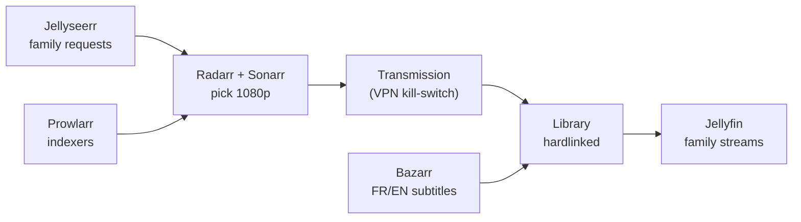
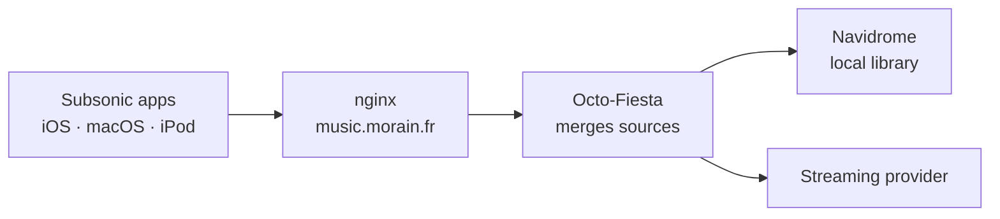

<!-- Profile README — alexis-morain. The OSS_PRS block is auto-updated daily, do not remove its markers. -->

<div align="center">


<a href="https://github.com/alexis-morain">
  
</a>

<p>
  <a href="https://www.malt.fr/profile/alexismorain">
    
  </a>
  <a href="https://www.linkedin.com/in/alexis-morain/">
    
  </a>
  <a href="mailto:alexis@morain.fr">
    
  </a>
  
</p>

</div>

---

## 👋 About me

```yaml
name:        Alexis Morain
role:        Builder, indie hacker, freelance growth + automation
location:    France 🇫🇷
focus:       shipping small useful products, self-hosting, automating workflows
currently:   Colophon, a desktop app that lays out a photo book from a folder
open_to:     freelance missions (Malt) and interesting collaborations
```

I build things end to end: a Rust engine, a React app, an n8n workflow, a Docker stack behind Traefik. I run my own infrastructure at home, and I contribute the fixes I need back to the open source tools I use. Most of what is listed below started because something I ran every day annoyed me.

---

## 🖼️ Colophon — what I spend my nights on

**[colophon](https://github.com/alexis-morain/colophon)** turns a folder of photos into a print-ready album in under a minute. Point it at a folder, it reads the files, throws out what would weaken the book, lays out every spread, and hands you a draft you can argue with. Export a 300 dpi PDF, print it wherever you like.

What Darktable is to Lightroom, Colophon is to Blurb. Free, offline, GPL-3.0. No account, no cloud, and it never writes to your originals.

Under the hood: a Rust engine that scans, dedups, scores sharpness and finds faces, a layout composer working under hard constraints instead of vibes, and a linter of ten counters that grades the draft before you do. Interface in React behind a Tauri shell. It reads JPEG, PNG, HEIC and camera RAW straight from the folder, and it respects the culling you already did in Lightroom.

<p>
  <a href="https://github.com/alexis-morain/colophon"></a>
  <a href="https://alexis-morain.github.io/colophon-site/"></a>
  
  
  
  
  
</p>

---

## 🚀 What I'm building

<div align="center">
  <a href="https://github.com/alexis-morain/colophon">
    
  </a>
  <a href="https://github.com/alexis-morain/verbatim-linkedin">
    
  </a>
  <a href="https://github.com/alexis-morain/permis-cotier">
    
  </a>
  <a href="https://github.com/alexis-morain/slopradar">
    
  </a>
</div>

| Project | Stack | What it does |
|---|---|---|
| **[colophon](https://github.com/alexis-morain/colophon)** | Rust · Tauri · React | A folder of photos in, a print-ready album out. Offline, GPL-3.0 |
| **[verbatim-linkedin](https://github.com/alexis-morain/verbatim-linkedin)** | Python · Claude skills | A writing skill that interviews you first. It cannot write a sentence you did not say |
| **[permis-cotier](https://github.com/alexis-morain/permis-cotier)** | Astro · React · TS | Free revision for the French coastal boating licence. Every question cites the regulation it comes from |
| **[slopradar](https://github.com/alexis-morain/slopradar)** | Node · Playwright | Scores how much of a website came straight out of a default prompt. Deterministic, zero LLM in the score |
| **[saasradar](https://github.com/alexis-morain/saasradar)** | Open data · CC0 | Curated directory of SaaS tools, independently reviewed |
| **[polymarket-bot](https://github.com/alexis-morain/polymarket-bot)** | Python | Quant bot betting on the daily max temperature in Paris |
| **[secret-santa](https://github.com/alexis-morain/secret-santa)** | React · Vite | Secret Santa without signup, shareable links 🎅 |

Two more stay private for now: a dual-momentum (GEM Antonacci) rebalancer for Trading 212, and my personal site.

---

## 🌱 Open source contributions

I self-host a lot, so I hit the rough edges of these tools daily. When a fix is worth having, I send it upstream rather than keep a patched fork.

<!-- OSS_PRS:START -->
<!-- This section is auto-updated daily by .github/workflows/update-readme.yml -->

**18 pull requests merged upstream**, 8 in review, across 7 projects.

| Project | What it is | Merged | In review |
|---|---|:--:|:--:|
| **[Shelv](https://github.com/gatzenga/Shelv)** | Native Navidrome player for Apple platforms | 10 | 3 |
| **[one_second_diary](https://github.com/KyleKun/one_second_diary)** | Minimalist video diary, one second a day | 3 | — |
| **[Cap](https://github.com/CapSoftware/Cap)** | Open source Loom alternative | 2 | 2 |
| **[octo-fiesta](https://github.com/V1ck3s/octo-fiesta)** | Subsonic proxy that merges several music sources | 2 | 1 |
| **[decluttarr](https://github.com/ManiMatter/decluttarr)** | Download queue cleaner for the \*arr stack | 1 | — |
| **[vorssaint-utils](https://github.com/vorssaint/vorssaint-utils)** | macOS menu bar toolkit | 0 | 1 |
| **[motis](https://github.com/motis-project/motis)** | Multimodal routing and map tiles engine | 0 | 1 |

<details>
<summary><b>Every pull request, most recent first</b></summary>

**[gatzenga/Shelv](https://github.com/gatzenga/Shelv)**

- **[#48](https://github.com/gatzenga/Shelv/pull/48)** — feat: stream the original at home without asking for a location · 🔵 *in review*
- **[#47](https://github.com/gatzenga/Shelv/pull/47)** — fix: say when the artist page fell back to downloads · ✅ *merged*
- **[#46](https://github.com/gatzenga/Shelv/pull/46)** — fix: make the tvOS target build again · ✅ *merged*
- **[#45](https://github.com/gatzenga/Shelv/pull/45)** — fix: make the request-coalescing test stop racing itself · ✅ *merged*
- *…and 9 more on [Shelv](https://github.com/gatzenga/Shelv/pulls?q=is%3Apr+author%3Aalexis-morain)*

**[KyleKun/one_second_diary](https://github.com/KyleKun/one_second_diary)**

- **[#155](https://github.com/KyleKun/one_second_diary/pull/155)** — docs: fix the MediaGallery.save contract, and record the iOS device status · ✅ *merged*
- **[#153](https://github.com/KyleKun/one_second_diary/pull/153)** — fix(ios): two device-blocking crashes, and main compiles again · ✅ *merged*
- **[#152](https://github.com/KyleKun/one_second_diary/pull/152)** — feat(ios): make the app run on iOS · ✅ *merged*

**[CapSoftware/Cap](https://github.com/CapSoftware/Cap)**

- **[#1907](https://github.com/CapSoftware/Cap/pull/1907)** — feat(share): configurable call-to-action button on shared videos · 🔵 *in review*
- **[#1900](https://github.com/CapSoftware/Cap/pull/1900)** — feat(emails): pluggable email provider (Resend + SMTP) · 🔵 *in review*
- **[#1889](https://github.com/CapSoftware/Cap/pull/1889)** — feat(dashboard): allow starting a new recording from inside a folder · ✅ *merged*
- **[#1888](https://github.com/CapSoftware/Cap/pull/1888)** — fix(dashboard): bypass Rive in folder create/subfolder dialogs · ✅ *merged*

**[V1ck3s/octo-fiesta](https://github.com/V1ck3s/octo-fiesta)**

- **[#312](https://github.com/V1ck3s/octo-fiesta/pull/312)** — feat(subsonic): merge provider catalogue into getTopSongs · 🔵 *in review*
- **[#267](https://github.com/V1ck3s/octo-fiesta/pull/267)** — feat(lyrics): synced lyrics for external tracks via LRCLIB · ✅ *merged*
- **[#265](https://github.com/V1ck3s/octo-fiesta/pull/265)** — feat(qobuz): support custom App ID/secret for tokens not issued by the web player · ✅ *merged*

**[ManiMatter/decluttarr](https://github.com/ManiMatter/decluttarr)**

- **[#364](https://github.com/ManiMatter/decluttarr/pull/364)** — feat(remove_metadata_missing): detect stuck metadata for non-qBittorrent clients (opt-in) · ✅ *merged*

**[vorssaint/vorssaint-utils](https://github.com/vorssaint/vorssaint-utils)**

- **[#1103](https://github.com/vorssaint/vorssaint-utils/pull/1103)** — fix(command-bar): give the field back Cmd+A, C, X and V · 🔵 *in review*

**[motis-project/motis](https://github.com/motis-project/motis)**

- **[#1579](https://github.com/motis-project/motis/pull/1579)** — gbfs: read num_docks_available, the conditionally required free dock count · 🔵 *in review*

</details>
<!-- OSS_PRS:END -->

I also keep tweaked forks of [decluttarr](https://github.com/alexis-morain/decluttarr) and [octo-fiesta](https://github.com/alexis-morain/octo-fiesta) for my own stack.

---

## 🏠 Self-hosted homelab

Everything runs on one box at home: TrueNAS on a ZFS mirror, Docker for the apps, Traefik and Coolify in front, Cloudflare Tunnel to publish, Tailscale to reach it from anywhere. No VPS in the picture.

**Family media server** — request to stream, fully automated. A relative asks for a movie, it gets found, downloaded behind a VPN kill-switch, hardlinked into the library and subtitled, all on its own.



**Music server** — Navidrome for the local library, Octo-Fiesta in front to merge in streaming sources, one Subsonic endpoint for every device in the house. This is also my test bench: it is the reason I contribute to [Shelv](https://github.com/gatzenga/Shelv) and [octo-fiesta](https://github.com/V1ck3s/octo-fiesta) upstream.



**Self-hosted CRM + automation** — a [Twenty](https://twenty.com) CRM instance with two n8n pipelines I built around it:

- **Indy → Twenty invoice sync**: pulls invoices from Indy (no public API) into custom CRM objects, dedup by number, status tracking.
- **data.gouv enrichment**: on every new contact, auto-enriches the company from the official SIRENE registry (SIREN, headcount, NAF code) and geocodes the address via the BAN API.

<p>
  
  
  
  
  
  
  
  
  
  
  
</p>

---

## 🧰 Stack I work with

<p align="center">
  
</p>

---

## 📊 GitHub stats

<div align="center">


<picture>
  <source media="(prefers-color-scheme: dark)" srcset="https://raw.githubusercontent.com/alexis-morain/alexis-morain/output/github-contribution-grid-snake-dark.svg">
  <source media="(prefers-color-scheme: light)" srcset="https://raw.githubusercontent.com/alexis-morain/alexis-morain/output/github-contribution-grid-snake.svg">
  
</picture>


</div>

---

<div align="center">

### 💬 Let's talk

I'm available for freelance missions on **[Malt](https://www.malt.fr/profile/alexismorain)** and open to interesting collaborations.

Drop me a line: **[alexis@morain.fr](mailto:alexis@morain.fr)**


</div>
